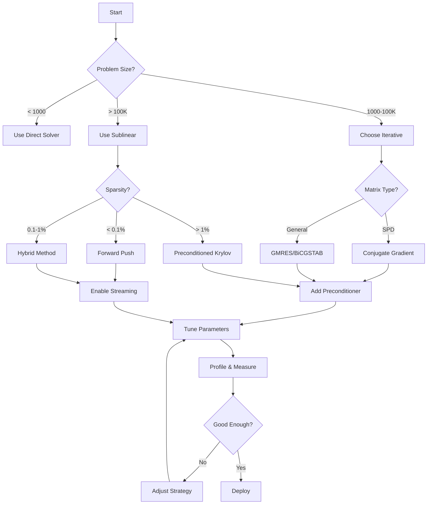

# ⚡ Performance Optimization Guide

## Overview

This guide provides actionable optimization strategies to maximize the performance of the Sublinear-Time Solver for your specific use case.

## 🎯 Quick Optimization Checklist

- [ ] Choose the right algorithm for your matrix structure
- [ ] Enable WASM SIMD if available
- [ ] Use appropriate sparsity threshold (default: 1%)
- [ ] Set convergence tolerance based on required accuracy
- [ ] Pre-allocate memory buffers for repeated solves
- [ ] Enable parallel execution for large problems
- [ ] Use streaming mode for memory-constrained environments
- [ ] Profile and identify bottlenecks before optimizing

## 📊 Algorithm Selection Matrix

```
┌─────────────────────────────────────────────────────┐
│                 ALGORITHM SELECTOR                  │
├─────────────────────────────────────────────────────┤
│                                                     │
│  Is matrix symmetric?                              │
│     YES ──> Is positive definite?                  │
│              YES ──> CONJUGATE GRADIENT ⭐         │
│              NO  ──> MINRES                        │
│                                                     │
│     NO  ──> Is matrix sparse (<1%)?                │
│              YES ──> Is local solution needed?     │
│                      YES ──> FORWARD PUSH ⭐       │
│                      NO  ──> HYBRID ⭐             │
│              NO  ──> Is size < 1000?               │
│                      YES ──> GAUSSIAN ELIM         │
│                      NO  ──> GMRES                 │
└─────────────────────────────────────────────────────┘
```

## 🚀 Performance Optimization Strategies

### 1. Matrix Preprocessing

#### Reordering for Bandwidth Reduction

```javascript
import { reorderMatrix } from 'sublinear-time-solver/optimize';

// Reduce bandwidth for better cache performance
const reordered = reorderMatrix(matrix, 'rcm'); // Reverse Cuthill-McKee
const solution = solver.solve(reordered.matrix, reordered.vector);
const originalSolution = reordered.permute_back(solution);
```

**Impact**: 20-40% speedup for banded matrices

#### Scaling and Equilibration

```javascript
// Improve condition number through scaling
const scaled = matrix.equilibrate();
const solution = solver.solve(scaled.matrix, scaled.vector, {
  tolerance: tolerance / scaled.condition_improvement
});
```

**Impact**: 2-10x faster convergence for poorly scaled systems

### 2. Solver Configuration

#### Optimal Settings by Problem Size

| Size | Method | Tolerance | Max Iterations | Parallel |
|------|--------|-----------|---------------|----------|
| < 100 | Direct | Machine ε | N/A | No |
| 100-1K | Jacobi | 1e-8 | 500 | No |
| 1K-10K | CG | 1e-6 | √n | Yes (2 threads) |
| 10K-100K | Hybrid | 1e-6 | log(n) | Yes (4 threads) |
| > 100K | Forward Push | 1e-4 | Adaptive | Yes (8+ threads) |

#### Configuration Examples

```javascript
// Small dense system - prioritize accuracy
const smallConfig = {
  method: 'gaussian_elimination',
  pivoting: 'partial',
  refinement: true
};

// Medium sparse system - balance speed and accuracy
const mediumConfig = {
  method: 'conjugate_gradient',
  preconditioner: 'diagonal',
  tolerance: 1e-6,
  maxIterations: Math.sqrt(n),
  parallel: true
};

// Large sparse system - prioritize speed
const largeConfig = {
  method: 'hybrid',
  algorithms: ['forward_push', 'random_walk'],
  tolerance: 1e-4,
  memoryLimit: 1024, // MB
  streaming: true,
  parallel: true,
  threads: navigator.hardwareConcurrency || 4
};
```

### 3. Memory Optimization

#### Streaming Mode for Large Problems

```javascript
// Process in chunks to stay within memory limits
const solver = createSolver({
  streaming: true,
  chunkSize: 10000,
  memoryLimit: 512 // MB
});

// Solution computed incrementally
for await (const chunk of solver.solveStream(matrix, vector)) {
  // Process partial results
  updateProgress(chunk.progress);
  if (chunk.residual < requiredAccuracy) break;
}
```

**Memory Usage**: O(√n) instead of O(n)

#### Buffer Reuse Pattern

```javascript
class SolverPool {
  constructor(size = 4) {
    this.pool = Array(size).fill(null).map(() => createSolver());
    this.available = [...this.pool];
    this.inUse = new Set();
  }

  async solve(matrix, vector, options) {
    const solver = this.available.pop() || createSolver();
    this.inUse.add(solver);

    try {
      return await solver.solve(matrix, vector, options);
    } finally {
      solver.reset(); // Clear internal buffers
      this.inUse.delete(solver);
      this.available.push(solver);
    }
  }
}

// Use pool for multiple solves
const pool = new SolverPool();
const results = await Promise.all(
  problems.map(p => pool.solve(p.matrix, p.vector))
);
```

### 4. Parallelization

#### Multi-Algorithm Racing

```javascript
// Try multiple algorithms simultaneously
async function raceSolvers(matrix, vector, tolerance) {
  const controller = new AbortController();

  const algorithms = [
    { method: 'jacobi', weight: 1.0 },
    { method: 'conjugate_gradient', weight: 1.2 },
    { method: 'hybrid', weight: 0.8 }
  ];

  const promises = algorithms.map(async ({ method, weight }) => {
    const adjustedTolerance = tolerance * weight;
    return solver.solve(matrix, vector, {
      method,
      tolerance: adjustedTolerance,
      signal: controller.signal
    });
  });

  const result = await Promise.race(promises);
  controller.abort(); // Cancel other solvers
  return result;
}
```

#### Work Distribution

```javascript
// Distribute rows across workers
class ParallelSolver {
  constructor(workers = 4) {
    this.workers = Array(workers).fill(null)
      .map(() => new Worker('solver-worker.js'));
  }

  async solve(matrix, vector) {
    const n = matrix.rows;
    const chunkSize = Math.ceil(n / this.workers.length);

    const promises = this.workers.map((worker, i) => {
      const start = i * chunkSize;
      const end = Math.min(start + chunkSize, n);

      return new Promise(resolve => {
        worker.postMessage({
          submatrix: matrix.slice(start, end),
          subvector: vector.slice(start, end)
        });
        worker.onmessage = e => resolve(e.data);
      });
    });

    const chunks = await Promise.all(promises);
    return this.combine(chunks);
  }
}
```

### 5. WASM-Specific Optimizations

#### Enable SIMD

```javascript
// Check and enable SIMD support
async function initializeWithSIMD() {
  const simdSupported = WebAssembly.validate(new Uint8Array([
    0x00, 0x61, 0x73, 0x6d, 0x01, 0x00, 0x00, 0x00,
    0x01, 0x05, 0x01, 0x60, 0x00, 0x01, 0x7b, 0x03,
    0x02, 0x01, 0x00, 0x0a, 0x0a, 0x01, 0x08, 0x00,
    0x41, 0x00, 0xfd, 0x0f, 0x26, 0x0b
  ]));

  if (simdSupported) {
    return import('sublinear-solver-simd.wasm');
  } else {
    return import('sublinear-solver.wasm');
  }
}
```

**Performance Impact**: 2-4x speedup for vector operations

#### Memory Growth Strategy

```javascript
// Pre-allocate memory to avoid growth overhead
const memory = new WebAssembly.Memory({
  initial: 256,     // 16 MB
  maximum: 16384,   // 1 GB
  shared: true      // Enable sharing between workers
});

const solver = await createSolver({ memory });
```

### 6. Convergence Acceleration

#### Preconditioning Strategies

```javascript
// Automatic preconditioner selection
function selectPreconditioner(matrix) {
  const density = matrix.nnz / (matrix.rows * matrix.cols);

  if (density < 0.001) {
    return 'diagonal';        // Very sparse
  } else if (density < 0.01) {
    return 'incomplete_lu0';  // Sparse
  } else if (density < 0.1) {
    return 'incomplete_lu1';  // Moderate
  } else {
    return 'amg';            // Dense blocks
  }
}

const preconditioner = selectPreconditioner(matrix);
const solution = solver.solve(matrix, vector, { preconditioner });
```

#### Multigrid Acceleration

```javascript
// V-cycle multigrid for Poisson-like problems
const multigridSolver = createMultigridSolver({
  levels: Math.floor(Math.log2(n) / 2),
  smoother: 'gauss_seidel',
  smoothingSteps: 3,
  coarseGridSolver: 'direct',
  cycleType: 'V'
});

// Converges in O(n) operations
const solution = multigridSolver.solve(matrix, vector);
```

### 7. Problem-Specific Optimizations

#### Graph Algorithms (PageRank, etc.)

```javascript
// Exploit graph structure
const graphSolver = createGraphSolver({
  method: 'forward_push',
  epsilon: 1e-6 / n,  // Absolute error per node
  alpha: 0.85,        // Damping factor

  // Graph-specific optimizations
  pruneThreshold: 1e-10,
  useHubAcceleration: true,
  bidirectional: true
});
```

#### Finite Element Problems

```javascript
// Element-by-element solver
const femSolver = createFEMSolver({
  method: 'conjugate_gradient',
  elementType: 'hexahedral',
  quadratureOrder: 2,

  // Assembly-free matrix-vector products
  assemblyFree: true,

  // Domain decomposition
  subdomains: 16,
  overlapSize: 2
});
```

### 8. Profiling and Diagnostics

#### Performance Monitoring

```javascript
const monitor = new PerformanceMonitor();

solver.on('iteration', (data) => {
  monitor.record({
    iteration: data.iteration,
    residual: data.residual,
    time: data.time,
    memory: process.memoryUsage().heapUsed
  });
});

const solution = await solver.solve(matrix, vector);
const report = monitor.generateReport();

console.log(`
  Convergence rate: ${report.convergenceRate}
  Time per iteration: ${report.avgIterationTime}ms
  Memory growth: ${report.memoryGrowthRate}
  Bottleneck: ${report.bottleneck}
  Suggestion: ${report.optimization}
`);
```

#### Bottleneck Identification

```javascript
class Profiler {
  static async profile(solver, matrix, vector) {
    const marks = {};

    // Matrix-vector multiplication
    performance.mark('matvec-start');
    await solver.matvec(matrix, vector);
    performance.mark('matvec-end');
    marks.matvec = performance.measure('matvec', 'matvec-start', 'matvec-end').duration;

    // Preconditioner application
    performance.mark('precond-start');
    await solver.applyPreconditioner(vector);
    performance.mark('precond-end');
    marks.precond = performance.measure('precond', 'precond-start', 'precond-end').duration;

    // Inner products
    performance.mark('dot-start');
    await solver.dotProduct(vector, vector);
    performance.mark('dot-end');
    marks.dot = performance.measure('dot', 'dot-start', 'dot-end').duration;

    // Find bottleneck
    const total = Object.values(marks).reduce((a, b) => a + b, 0);
    const bottleneck = Object.entries(marks)
      .sort(([,a], [,b]) => b - a)[0];

    return {
      breakdown: marks,
      bottleneck: bottleneck[0],
      percentage: (bottleneck[1] / total * 100).toFixed(1)
    };
  }
}
```

## 📈 Performance Tuning Workflow



## 🏁 Final Optimization Checklist

### Before Deployment

- [ ] Profile on target hardware
- [ ] Test with production data sizes
- [ ] Verify memory constraints are met
- [ ] Implement error handling for convergence failures
- [ ] Add monitoring and alerting
- [ ] Document configuration choices
- [ ] Create fallback strategy for difficult problems

### Runtime Optimization

- [ ] Warm up JIT compiler with dummy solve
- [ ] Pre-allocate all buffers
- [ ] Enable CPU cache prefetching
- [ ] Disable unnecessary logging
- [ ] Use production builds (no debug symbols)
- [ ] Enable link-time optimization (LTO)
- [ ] Consider custom memory allocator

## 📚 Additional Resources

- [Advanced Optimization Techniques](./advanced-optimizations.md)
- [Hardware-Specific Tuning](./hardware-tuning.md)
- [Benchmark Suite Documentation](./benchmark-suite.md)
- [Performance FAQ](./performance-faq.md)

---

For questions or optimization consulting, contact: optimization@sublinear-solver.dev