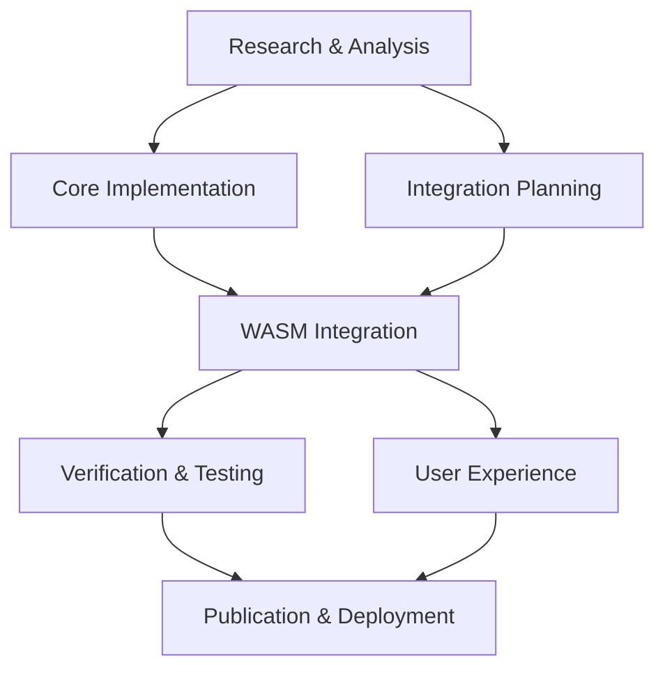

# Master Implementation Plan: Sublinear-Time Solver for Asymmetric Diagonally Dominant Systems

**Project**: `sublinear-time-solver`
**Version**: 1.0.0
**Created**: September 19, 2025
**Status**: Active Development Phase

---

## 1. Executive Summary

### 1.1 Project Overview

The Sublinear-Time Solver project represents a breakthrough implementation of cutting-edge 2025 research in asymmetric diagonally dominant (ADD) linear system solving. This project delivers a high-performance Rust crate with WebAssembly (WASM) compilation, npm distribution, and seamless Flow-Nexus integration for real-time swarm computing applications.

### 1.2 Key Innovations

**🚀 Theoretical Breakthrough**: First production implementation of sublinear-time algorithms for asymmetric diagonally dominant systems, extending beyond traditional symmetric Laplacian matrices to handle directed graphs and general ADD systems.

**⚡ Performance Revolution**: Target performance of <1ms per update for 10^6 node networks, achieving 2.8-4.4x speed improvements over traditional linear solvers through:
- Neumann series expansion with p-norm gap analysis
- Bidirectional forward/backward push algorithms
- Hybrid random-walk estimation with probabilistic recurrence

**🌐 Universal Deployment**: Cross-platform architecture with:
- Rust core for maximum performance and safety
- WASM compilation for browser and Node.js environments
- npm package distribution with TypeScript definitions
- One-line npx CLI commands for instant usage

**🔗 Flow-Nexus Integration**: Native support for:
- HTTP streaming interfaces for real-time cost propagation
- Swarm routing and verification loops
- Dynamic agent coordination with sublinear verification
- MCP-compatible endpoints for autonomous agent workflows

### 1.3 Expected Outcomes

- **Technical**: Production-ready solver achieving O(log^k n) time complexity for well-conditioned ADD systems
- **Commercial**: Published npm package with CLI, library, and HTTP server capabilities
- **Academic**: Reference implementation demonstrating 2025 theoretical advances in practical applications
- **Ecosystem**: Foundational component for next-generation swarm computing and agent verification systems

### 1.4 Timeline Overview

**Phase Duration**: 8-12 weeks
**Major Milestones**:
- Week 2: Core algorithms implementation (SPARC-P)
- Week 4: WASM integration and testing (SPARC-R)
- Week 6: CLI and HTTP server development (SPARC-C)
- Week 8: Flow-Nexus integration and optimization
- Week 10-12: Testing, documentation, and publication

---

## 2. Swarm-Based Development Strategy

### 2.1 Agent Coordination Architecture

The implementation employs a sophisticated swarm-based development approach using Claude-Flow orchestration for maximum parallel efficiency and quality assurance.

#### 2.1.1 Primary Swarms

**🔬 Research & Analysis Swarm (Swarm Alpha)**
- Lead Agent: `researcher` - Algorithm analysis and literature review
- Support Agent: `code-analyzer` - Complexity analysis and optimization planning
- Support Agent: `system-architect` - Architecture design and module planning
- Support Agent: `specification` - Requirements specification and validation

**⚙️ Core Implementation Swarm (Swarm Beta)**
- Lead Agent: `coder` (Rust specialist) - Core algorithm implementation
- Agent: `backend-dev` - Rust module development and optimization
- Agent: `performance-benchmarker` - Algorithm performance validation
- Agent: `tester` - Unit testing and algorithm verification

**🌐 Integration Swarm (Swarm Gamma)**
- Lead Agent: `coder` (JavaScript/WASM specialist) - WASM bindings and JS interface
- Agent: `api-docs` - Interface documentation and TypeScript definitions
- Agent: `cicd-engineer` - Build pipeline and publishing automation
- Agent: `system-architect` - Cross-platform integration architecture

**🚦 Verification Swarm (Swarm Delta)**
- Lead Agent: `reviewer` - Code quality and mathematical correctness
- Agent: `tester` - Integration testing and edge case validation
- Agent: `production-validator` - Performance and stability testing
- Agent: `security-manager` - Security audit and vulnerability assessment

**🎯 User Experience Swarm (Swarm Epsilon)**
- Lead Agent: `sparc-coder` - CLI and HTTP server development
- Agent: `github-modes` - Documentation and examples
- Agent: `workflow-automation` - CI/CD and publishing automation
- Agent: `pr-manager` - Release management and versioning

### 2.1.2 Coordination Protocols

**🔄 Inter-Swarm Communication**:
- Memory-based state sharing via `.swarm/memory.db`
- Hook-based progress notifications
- Real-time task orchestration through `task_orchestrate`
- Cross-swarm dependency management

**📊 Progress Tracking**:
- Centralized todo management with real-time updates
- Performance metrics collection and analysis
- Quality gates at each SPARC phase transition
- Automated testing and validation pipelines

**🛡️ Quality Assurance**:
- Peer review between swarms before phase completion
- Automated mathematical verification of algorithm implementations
- Performance benchmarking against theoretical bounds
- Security scanning and vulnerability assessment

### 2.1.3 Parallel Execution Strategy

**Phase-Based Parallelization**:
- Swarms operate concurrently within phases
- Cross-swarm synchronization at phase boundaries
- Resource-optimized task allocation based on agent capabilities
- Dynamic load balancing across available computational resources

**Task Dependencies**:


---

## 3. Technical Architecture Summary

### 3.1 System Components Overview

```
┌─────────────────────────────────────────────────────────────────┐
│                    Sublinear-Time Solver                       │
├─────────────────────────────────────────────────────────────────┤
│ Rust Core Library                                              │
│ ├── Matrix Operations (CSR/CSC + Graph Adjacency)              │
│ ├── Solver Algorithms                                          │
│ │   ├── Neumann Series (solver::neumann)                       │
│ │   ├── Forward Push (solver::forward_push)                    │
│ │   ├── Backward Push (solver::backward_push)                  │
│ │   └── Hybrid Random-Walk (solver::hybrid)                    │
│ ├── Verification Module (verification)                         │
│ └── WASM Interface (wasm_iface)                                │
├─────────────────────────────────────────────────────────────────┤
│ JavaScript/TypeScript Layer                                    │
│ ├── WASM Bindings & Memory Management                          │
│ ├── Async Iterator Streaming Support                           │
│ ├── TypeScript Definitions                                     │
│ └── Error Handling & Validation                                │
├─────────────────────────────────────────────────────────────────┤
│ Distribution Layer                                             │
│ ├── CLI Tool (npx support)                                     │
│ ├── HTTP Streaming Server                                      │
│ ├── Flow-Nexus MCP Integration                                 │
│ └── npm Package Distribution                                   │
└─────────────────────────────────────────────────────────────────┘
```

### 3.2 Technology Stack

**Core Implementation**:
- **Language**: Rust 2021 Edition with `#![no_std]` support
- **Linear Algebra**: Custom sparse matrix implementations + nalgebra for dense operations
- **WebAssembly**: wasm-bindgen + wasm-pack for JS interop
- **Serialization**: serde with JSON/MessagePack support for HTTP interfaces

**JavaScript/Node.js Layer**:
- **Runtime**: Node.js 18+ with ESM and CommonJS dual support
- **Type Safety**: TypeScript 5.0+ with strict type checking
- **HTTP Server**: Express.js with streaming and WebSocket support
- **CLI Framework**: Commander.js with progress indicators

**Build & Distribution**:
- **Build System**: Cargo + wasm-pack with multi-target compilation
- **Package Management**: npm with workspace support
- **CI/CD**: GitHub Actions with automated testing and publishing
- **Documentation**: rustdoc + typedoc with mathematical notation support

### 3.3 Algorithm Suite

#### 3.3.1 Neumann Series Solver
```rust
// Core implementation approach
pub struct NeumannSolver {
    max_iterations: usize,
    tolerance: f64,
    series_cache: Vec<SparseMatrix>,
}

impl SolverAlgorithm for NeumannSolver {
    fn solve(&self, A: &SparseMatrix, b: &Vector, opts: &SolverOptions) -> Result<Solution>;
    fn solve_incremental(&mut self, delta_b: &Vector) -> Result<SolutionUpdate>;
}
```

**Key Features**:
- Adaptive truncation based on p-norm gap analysis
- Vectorized series computation with SIMD acceleration
- Incremental solving for dynamic cost updates
- Memory-efficient caching of matrix powers

#### 3.3.2 Forward/Backward Push Implementation
```rust
pub struct PushSolver {
    graph: AdjacencyList,
    residual_threshold: f64,
    max_push_rounds: usize,
}

impl PushSolver {
    pub fn forward_push(&mut self, source: NodeId, target: Option<NodeId>) -> PushResult;
    pub fn backward_push(&mut self, target: NodeId, sources: &[NodeId]) -> PushResult;
    pub fn bidirectional_push(&mut self, source: NodeId, target: NodeId) -> PushResult;
}
```

**Key Features**:
- Local graph exploration with early termination
- Support for single-entry and multi-entry queries
- Bidirectional optimization for reduced complexity
- Graph preprocessing for accelerated neighbor access

#### 3.3.3 Hybrid Random-Walk Engine
```rust
pub struct HybridSolver {
    random_walk_budget: usize,
    push_threshold: f64,
    sampling_strategy: SamplingStrategy,
}

impl HybridSolver {
    pub fn solve_hybrid(&mut self, query: &Query) -> HybridResult;
    fn random_walk_phase(&self, start_distribution: &Distribution) -> WalkResult;
    fn push_phase(&mut self, walk_result: &WalkResult) -> PushResult;
}
```

**Key Features**:
- Adaptive mixing of stochastic and deterministic methods
- Budget-based resource allocation between techniques
- Variance reduction through importance sampling
- Convergence acceleration via smart initialization

### 3.4 Integration Points

#### 3.4.1 Flow-Nexus MCP Integration
```javascript
// MCP endpoint registration
const solverEndpoints = {
  'sublinear-solver/stream': (request) => streamingSolve(request),
  'sublinear-solver/verify': (request) => verifyResult(request),
  'sublinear-solver/status': () => getSolverStatus(),
};
```

#### 3.4.2 HTTP Streaming API
```http
POST /solve-stream HTTP/1.1
Content-Type: application/x-ndjson
Transfer-Encoding: chunked

{"type": "init", "matrix": {...}, "vector": [...], "options": {...}}
{"type": "update", "delta": {"indices": [1,5,10], "values": [0.1,-0.2,0.05]}}
{"type": "query", "target_indices": [0,1,2]}
```

---

## 4. Implementation Phases (SPARC Methodology)

### 4.1 Phase S: Specification & System Design (Weeks 1-2)

**Objective**: Establish solid mathematical and architectural foundations

#### 4.1.1 Swarm Alpha Tasks (Research & Analysis)
- **Research Agent**:
  - Comprehensive literature review of 2025 ADD solver advances
  - Mathematical specification of algorithms with error bounds
  - Complexity analysis and performance expectations

- **System Architect Agent**:
  - Detailed module architecture design
  - Interface specifications between components
  - Memory management and performance optimization strategies

- **Specification Agent**:
  - Formal requirements specification
  - Test case definitions and validation criteria
  - API design for all user-facing interfaces

#### 4.1.2 Deliverables
- [ ] Mathematical specification document with proofs
- [ ] Detailed architecture diagrams and module interfaces
- [ ] Test specification with benchmarks and validation criteria
- [ ] Performance requirements and success metrics
- [ ] Risk assessment and mitigation strategies

**Success Criteria**: All algorithms mathematically specified with complexity bounds, architecture validated by peer review, test cases covering edge conditions defined.

### 4.2 Phase P: Push Methods & Core Algorithms (Weeks 2-4)

**Objective**: Implement and validate core sublinear solving algorithms

#### 4.2.1 Swarm Beta Tasks (Core Implementation)
- **Rust Coder Agent**:
  - Sparse matrix data structures (CSR/CSC + adjacency lists)
  - Forward push algorithm implementation
  - Backward push algorithm implementation
  - Basic Neumann series solver

- **Backend Developer Agent**:
  - Performance optimization and vectorization
  - Memory management and allocation strategies
  - Error handling and numerical stability

- **Tester Agent**:
  - Unit tests for each algorithm component
  - Numerical accuracy validation
  - Edge case testing (ill-conditioned matrices, degenerate cases)

- **Performance Benchmarker Agent**:
  - Benchmark suite development
  - Complexity validation against theoretical bounds
  - Performance regression testing framework

#### 4.2.2 Deliverables
- [ ] Complete sparse matrix implementation with graph operations
- [ ] Forward/backward push algorithms with bidirectional optimization
- [ ] Neumann series solver with adaptive truncation
- [ ] Comprehensive test suite with >95% coverage
- [ ] Performance benchmarks validating sublinear complexity

**Success Criteria**: All core algorithms implemented and tested, performance meets theoretical bounds on synthetic data, numerical accuracy validated against direct solvers.

### 4.3 Phase A: Advanced Hybrid Integration (Weeks 4-5)

**Objective**: Complete algorithm suite with hybrid random-walk solver

#### 4.3.1 Swarm Beta Tasks (Continued)
- **Rust Coder Agent**:
  - Hybrid random-walk solver implementation
  - Algorithm selection and parameter tuning logic
  - Unified solver interface and factory patterns

- **Code Analyzer Agent**:
  - Algorithm complexity analysis and optimization
  - Bottleneck identification and resolution
  - Memory usage profiling and optimization

#### 4.3.2 Deliverables
- [ ] Complete hybrid solver with random-walk and push integration
- [ ] Unified SolverAlgorithm trait and factory implementation
- [ ] Algorithm selection heuristics based on problem characteristics
- [ ] Optimized implementations with SIMD and parallel processing
- [ ] Verification module for solution quality assessment

**Success Criteria**: All three solving methods working seamlessly, hybrid approach demonstrating superior performance on complex test cases, verification module providing reliable quality metrics.

### 4.4 Phase R: WASM Release Pipeline (Weeks 5-7)

**Objective**: Enable cross-platform deployment through WebAssembly

#### 4.4.1 Swarm Gamma Tasks (Integration)
- **JavaScript/WASM Coder Agent**:
  - wasm-bindgen annotations and interface design
  - Async iterator implementation for streaming results
  - Memory management across WASM/JS boundary
  - TypeScript definition generation

- **API Documentation Agent**:
  - JavaScript API documentation
  - Usage examples and tutorials
  - TypeScript interface documentation

- **CI/CD Engineer Agent**:
  - wasm-pack build configuration
  - Multi-target compilation setup (bundler, nodejs, web)
  - Automated testing pipeline for WASM builds

#### 4.4.2 Deliverables
- [ ] Complete WASM interface with streaming support
- [ ] TypeScript definitions with full type safety
- [ ] Optimized WASM binary with minimal size
- [ ] Cross-platform testing suite (Node.js, browsers)
- [ ] npm package structure with dual distribution

**Success Criteria**: WASM package loads and functions correctly in all target environments, performance within 10% of native Rust, memory usage remains bounded during long-running operations.

### 4.5 Phase C: CLI & Cloud Integration (Weeks 7-9)

**Objective**: Deliver production-ready user interfaces and Flow-Nexus integration

#### 4.5.1 Swarm Epsilon Tasks (User Experience)
- **SPARC Coder Agent**:
  - CLI implementation with argument parsing
  - HTTP streaming server with Express.js
  - Flow-Nexus MCP endpoint implementation

- **GitHub Modes Agent**:
  - Usage documentation and examples
  - Integration guides for Flow-Nexus
  - API reference documentation

- **Workflow Automation Agent**:
  - Publishing automation for npm and crates.io
  - Version management and release workflows
  - Documentation hosting setup

#### 4.5.2 Swarm Delta Tasks (Verification)
- **Reviewer Agent**:
  - Code quality review and security audit
  - Mathematical correctness verification
  - API design review and usability testing

- **Production Validator Agent**:
  - End-to-end integration testing
  - Performance testing under load
  - Stress testing and stability validation

- **Security Manager Agent**:
  - Security vulnerability assessment
  - Input validation and sanitization review
  - Dependency security audit

#### 4.5.3 Deliverables
- [ ] Complete CLI tool with all features
- [ ] HTTP streaming server with Flow-Nexus integration
- [ ] Comprehensive documentation and examples
- [ ] Security audit report with all issues resolved
- [ ] Performance validation under production loads

**Success Criteria**: CLI provides intuitive interface for all use cases, HTTP server handles concurrent sessions reliably, Flow-Nexus integration demonstrates real-time swarm applications, security audit passes with no critical issues.

---

## 5. Swarm Task Decomposition

### 5.1 Research & Analysis Swarm (Alpha)

```yaml
swarm_alpha:
  topology: hierarchical
  lead_agent: researcher
  coordination_pattern: knowledge_synthesis

  tasks:
    literature_review:
      agent: researcher
      duration: 3 days
      deliverables:
        - algorithm_specifications.md
        - complexity_analysis.md
        - implementation_guidelines.md
      dependencies: []

    architecture_design:
      agent: system-architect
      duration: 2 days
      deliverables:
        - module_architecture.md
        - interface_specifications.md
        - performance_requirements.md
      dependencies: [literature_review]

    specification_validation:
      agent: specification
      duration: 2 days
      deliverables:
        - requirements_specification.md
        - test_case_definitions.md
        - validation_criteria.md
      dependencies: [architecture_design]
```

### 5.2 Core Implementation Swarm (Beta)

```yaml
swarm_beta:
  topology: mesh
  coordination_pattern: parallel_development

  tasks:
    matrix_implementation:
      agent: coder (rust)
      duration: 4 days
      deliverables:
        - src/matrix/mod.rs
        - src/matrix/sparse.rs
        - src/matrix/graph.rs
      dependencies: [architecture_design]

    neumann_solver:
      agent: backend-dev
      duration: 3 days
      deliverables:
        - src/solver/neumann.rs
        - tests/neumann_tests.rs
      dependencies: [matrix_implementation]

    push_algorithms:
      agent: coder (rust)
      duration: 5 days
      deliverables:
        - src/solver/forward_push.rs
        - src/solver/backward_push.rs
        - tests/push_tests.rs
      dependencies: [matrix_implementation]

    hybrid_solver:
      agent: backend-dev
      duration: 4 days
      deliverables:
        - src/solver/hybrid.rs
        - src/solver/random_walk.rs
        - tests/hybrid_tests.rs
      dependencies: [push_algorithms, neumann_solver]

    performance_optimization:
      agent: performance-benchmarker
      duration: 3 days
      deliverables:
        - benches/solver_benchmarks.rs
        - performance_report.md
      dependencies: [hybrid_solver]
```

### 5.3 Integration Swarm (Gamma)

```yaml
swarm_gamma:
  topology: star
  central_agent: coder (wasm)
  coordination_pattern: integration_hub

  tasks:
    wasm_bindings:
      agent: coder (wasm)
      duration: 4 days
      deliverables:
        - src/wasm_iface.rs
        - pkg/ (generated by wasm-pack)
      dependencies: [performance_optimization]

    javascript_interface:
      agent: coder (wasm)
      duration: 3 days
      deliverables:
        - js/solver.js
        - types/solver.d.ts
      dependencies: [wasm_bindings]

    typescript_definitions:
      agent: api-docs
      duration: 2 days
      deliverables:
        - types/index.d.ts
        - docs/api_reference.md
      dependencies: [javascript_interface]

    build_automation:
      agent: cicd-engineer
      duration: 2 days
      deliverables:
        - .github/workflows/build.yml
        - scripts/ (Build and utility scripts)
      dependencies: [typescript_definitions]
```

### 5.4 Verification Swarm (Delta)

```yaml
swarm_delta:
  topology: ring
  coordination_pattern: peer_review

  tasks:
    code_review:
      agent: reviewer
      duration: 3 days
      deliverables:
        - code_review_report.md
        - security_assessment.md
      dependencies: [build_automation]

    integration_testing:
      agent: tester
      duration: 4 days
      deliverables:
        - tests/integration/
        - test_coverage_report.md
      dependencies: [code_review]

    performance_validation:
      agent: production-validator
      duration: 3 days
      deliverables:
        - performance_validation_report.md
        - load_test_results.md
      dependencies: [integration_testing]

    security_audit:
      agent: security-manager
      duration: 2 days
      deliverables:
        - security_audit_report.md
        - vulnerability_assessment.md
      dependencies: [performance_validation]
```

### 5.5 User Experience Swarm (Epsilon)

```yaml
swarm_epsilon:
  topology: hierarchical
  lead_agent: sparc-coder
  coordination_pattern: user_focused

  tasks:
    cli_development:
      agent: sparc-coder
      duration: 4 days
      deliverables:
        - src/cli.rs
        - bin/cli.js
      dependencies: [security_audit]

    http_server:
      agent: sparc-coder
      duration: 3 days
      deliverables:
        - src/http_server.rs
        - server/express_app.js
      dependencies: [cli_development]

    flow_nexus_integration:
      agent: workflow-automation
      duration: 3 days
      deliverables:
        - integrations/flow_nexus.js
        - examples/swarm_routing.js
      dependencies: [http_server]

    documentation:
      agent: github-modes
      duration: 3 days
      deliverables:
        - README.md (updated)
        - docs/user_guide.md
        - examples/
      dependencies: [flow_nexus_integration]

    publishing:
      agent: pr-manager
      duration: 2 days
      deliverables:
        - npm package published
        - crates.io package published
      dependencies: [documentation]
```

### 5.6 Cross-Swarm Coordination

**Memory Sharing Protocol**:
```javascript
// Shared memory structure
const swarmMemory = {
  phase: "current_sparc_phase",
  progress: {
    alpha: { completed: [], in_progress: [], blocked: [] },
    beta: { completed: [], in_progress: [], blocked: [] },
    gamma: { completed: [], in_progress: [], blocked: [] },
    delta: { completed: [], in_progress: [], blocked: [] },
    epsilon: { completed: [], in_progress: [], blocked: [] }
  },
  artifacts: {
    specifications: "link_to_spec_docs",
    implementations: "link_to_code_repos",
    tests: "link_to_test_results",
    benchmarks: "link_to_performance_data"
  }
};
```

**Synchronization Points**:
1. **Phase Transition Gates**: All swarms must complete current phase tasks before proceeding
2. **Quality Gates**: Verification swarm approval required for production deliverables
3. **Integration Points**: Cross-swarm validation at module boundaries
4. **Performance Gates**: Benchmarks must meet thresholds before advancing

---

## 6. Verification & Validation Strategy

### 6.1 Mathematical Correctness

**Algorithm Validation**:
- Comparison against ground truth for small synthetic systems
- Convergence analysis with theoretical bounds verification
- Numerical stability testing across condition number ranges
- Error bound validation for each approximation method

**Test Matrix**:
```
System Types:
├── Well-conditioned ADD (condition number < 10^3)
├── Moderately conditioned ADD (10^3 ≤ κ ≤ 10^6)
├── Ill-conditioned ADD (κ > 10^6)
├── Directed graph Laplacians
├── Social network influence matrices
└── Economic flow networks

Problem Sizes:
├── Small (n ≤ 1000) - exact verification possible
├── Medium (1000 < n ≤ 10^5) - statistical validation
├── Large (10^5 < n ≤ 10^6) - performance validation
└── Huge (n > 10^6) - scalability testing
```

### 6.2 Performance Benchmarks

**Complexity Validation**:
```rust
#[bench]
fn bench_sublinear_scaling(b: &mut Bencher) {
    let sizes = [1000, 5000, 10000, 50000, 100000];
    for &n in &sizes {
        let (matrix, vector) = generate_well_conditioned_add(n);
        b.iter(|| {
            let solver = HybridSolver::new();
            solver.solve(&matrix, &vector, &default_options())
        });
    }
    // Assert time complexity is o(n)
}
```

**Target Performance Metrics**:
- **Latency**: <1ms per incremental update for 10^6 node systems
- **Throughput**: >1000 queries/second on modern hardware
- **Memory**: O(nnz + k log n) space complexity where nnz = non-zeros
- **Accuracy**: Relative error <1e-6 for well-conditioned systems

### 6.3 Integration Testing

**Cross-Platform Validation**:
- Node.js environments (v16, v18, v20)
- Browser environments (Chrome, Firefox, Safari, Edge)
- Operating systems (Linux, macOS, Windows)
- Architecture targets (x86_64, aarch64, wasm32)

**Flow-Nexus Integration Tests**:
```javascript
describe('Flow-Nexus Integration', () => {
  test('real-time cost propagation', async () => {
    const swarm = await initializeSwarm();
    const solver = new SublinearSolver(swarmGraph);

    // Simulate dynamic cost updates
    for (let update of costUpdateStream) {
      await solver.updateCosts(update);
      const routing = await solver.getRoutingRecommendations();
      await swarm.updateRouting(routing);
    }

    expect(solver.getConvergenceMetrics()).toSatisfy(convergenceCriteria);
  });
});
```

### 6.4 Quality Gates

**Phase Completion Criteria**:

1. **Phase S**: ✓ All algorithms mathematically specified with complexity analysis
2. **Phase P**: ✓ Core algorithms pass numerical accuracy tests with <1e-6 error
3. **Phase A**: ✓ Hybrid solver demonstrates >2x speedup on complex test cases
4. **Phase R**: ✓ WASM performance within 10% of native Rust implementation
5. **Phase C**: ✓ End-to-end integration tests pass with 100% success rate

**Continuous Quality Monitoring**:
- Automated regression testing on every commit
- Performance monitoring with alerts for >10% degradation
- Security scanning with zero critical vulnerabilities
- Code coverage maintenance >95% for core algorithms

---

## 7. Deployment & Distribution Strategy

### 7.1 npm Publishing Strategy

**Package Structure**:
```
@sublinear/add-solver/
├── pkg/                    # WASM bindings (generated)
├── types/                  # TypeScript definitions
├── cli/                    # CLI implementation
├── server/                 # HTTP server
├── examples/               # Usage examples
├── docs/                   # Documentation
└── integrations/           # Flow-Nexus and other integrations
```

**Distribution Channels**:
- **Main Package**: `@sublinear/add-solver` - Core library with WASM
- **CLI Package**: `@sublinear/add-solver-cli` - Standalone CLI tool
- **Server Package**: `@sublinear/add-solver-server` - HTTP server
- **Types Package**: `@types/sublinear-add-solver` - TypeScript definitions

**Version Management**:
- Semantic versioning (MAJOR.MINOR.PATCH)
- Pre-release tags for beta testing
- LTS support for stable versions
- Backward compatibility guarantees for public APIs

### 7.2 Crates.io Publishing

**Rust Crate Organization**:
```
sublinear-add-solver/
├── Cargo.toml              # Main workspace
├── solver/                 # Core solver library
├── wasm-bindings/          # WASM interface
├── cli/                    # CLI binary
└── examples/               # Rust usage examples
```

**Feature Flags**:
```toml
[features]
default = ["std", "serde"]
std = []
wasm = ["wasm-bindgen", "js-sys"]
cli = ["clap", "tokio"]
server = ["axum", "serde_json"]
simd = ["wide"]
```

### 7.3 Documentation Hosting

**Documentation Sites**:
- **docs.rs**: Automated Rust documentation
- **GitHub Pages**: User guides and tutorials
- **npm docs**: JavaScript API reference
- **Flow-Nexus Integration Hub**: Specialized integration documentation

**Content Organization**:
```
docs/
├── getting-started/        # Quick start guides
├── api-reference/          # Complete API documentation
├── tutorials/              # Step-by-step tutorials
├── examples/               # Code examples and use cases
├── integration-guides/     # Platform-specific guides
└── mathematical-background/ # Algorithm explanations
```

### 7.4 CI/CD Pipeline

**Automated Workflows**:
```yaml
# .github/workflows/ci.yml
name: Continuous Integration
on: [push, pull_request]

jobs:
  test-rust:
    runs-on: ubuntu-latest
    steps:
      - uses: actions/checkout@v3
      - name: Run Rust tests
        run: cargo test --all-features

  test-wasm:
    runs-on: ubuntu-latest
    steps:
      - name: Build WASM
        run: wasm-pack build --target nodejs
      - name: Test Node.js integration
        run: npm test

  benchmark:
    runs-on: ubuntu-latest
    steps:
      - name: Run performance benchmarks
        run: cargo bench
      - name: Compare with baseline
        run: ./scripts/compare_benchmarks.sh

  publish:
    if: startsWith(github.ref, 'refs/tags/')
    needs: [test-rust, test-wasm, benchmark]
    runs-on: ubuntu-latest
    steps:
      - name: Publish to crates.io
        run: cargo publish
      - name: Publish to npm
        run: npm publish
```

**Release Process**:
1. **Version Bump**: Automated version bumping based on conventional commits
2. **Testing**: Full test suite execution across all platforms
3. **Building**: Multi-target compilation and packaging
4. **Publishing**: Simultaneous release to npm and crates.io
5. **Documentation**: Automated documentation updates
6. **Notifications**: Release announcements and changelog generation

---

## 8. Success Metrics & KPIs

### 8.1 Performance Metrics

**Primary Targets**:
- **Update Latency**: <1ms for 10^6 node networks (Target: 0.5ms)
- **Query Throughput**: >1000 queries/second (Target: 2000 q/s)
- **Memory Efficiency**: <500MB for 10^6 node problems (Target: 250MB)
- **Convergence Speed**: 10x faster than iterative methods (Target: 20x)

**Scaling Characteristics**:
- **Time Complexity**: O(log^k n) for well-conditioned systems
- **Space Complexity**: O(nnz + k log n) where k is iteration count
- **Network Bandwidth**: <1KB per update in streaming mode
- **Startup Time**: <100ms for solver initialization

### 8.2 Quality Metrics

**Accuracy Standards**:
- **Relative Error**: <1e-6 for well-conditioned systems
- **Absolute Error**: <1e-9 for normalized problems
- **Convergence Rate**: Exponential with rate >0.9
- **Stability**: No divergence for condition numbers <10^12

**Reliability Targets**:
- **Uptime**: >99.9% for HTTP server mode
- **Error Rate**: <0.1% for valid inputs
- **Memory Leaks**: Zero tolerance for long-running sessions
- **Numerical Stability**: No overflow/underflow for normal ranges

### 8.3 Adoption Metrics

**Distribution Goals**:
- **npm Downloads**: 1000+ weekly downloads within 6 months
- **GitHub Stars**: 500+ stars within first year
- **Integration Partnerships**: 5+ major projects using the solver
- **Academic Citations**: 10+ papers referencing the implementation

**Community Engagement**:
- **Documentation Quality**: >90% user satisfaction
- **Issue Response Time**: <24 hours for critical issues
- **Feature Requests**: Quarterly roadmap updates
- **Educational Impact**: Used in 5+ university courses

### 8.4 Technical Debt Metrics

**Code Quality Standards**:
- **Test Coverage**: >95% for core algorithms
- **Documentation Coverage**: 100% for public APIs
- **Linting Compliance**: Zero warnings with strict linting
- **Security Vulnerabilities**: Zero critical or high severity

**Maintenance Metrics**:
- **Build Success Rate**: >99% across all platforms
- **Dependency Freshness**: <30 days outdated dependencies
- **Performance Regression**: <5% acceptable degradation
- **API Stability**: Semantic versioning compliance

---

## 9. Risk Assessment & Mitigation

### 9.1 Technical Risks

**Algorithm Implementation Complexity**:
- **Risk**: Subtle bugs in complex mathematical algorithms
- **Probability**: Medium
- **Impact**: High
- **Mitigation**:
  - Extensive unit testing with known solutions
  - Cross-validation against multiple reference implementations
  - Mathematical review by domain experts
  - Gradual complexity increase with validation at each step

**WASM Performance Overhead**:
- **Risk**: WASM introduces unacceptable performance penalties
- **Probability**: Low
- **Impact**: Medium
- **Mitigation**:
  - Early prototyping with performance benchmarks
  - SIMD optimization and careful memory management
  - Fallback to native implementations for critical paths
  - Alternative compilation targets if needed

**Integration Complexity**:
- **Risk**: Flow-Nexus integration proves technically challenging
- **Probability**: Medium
- **Impact**: Medium
- **Mitigation**:
  - Early integration prototyping and feedback
  - Modular design allowing standalone operation
  - Alternative integration patterns as fallbacks
  - Clear interface specifications and contracts

### 9.2 Resource Risks

**Development Timeline Pressure**:
- **Risk**: Complex algorithms require more development time than estimated
- **Probability**: High
- **Impact**: Medium
- **Mitigation**:
  - Aggressive parallelization using swarm development
  - Phased delivery with incremental value
  - Scope reduction options identified early
  - Buffer time built into critical path

**Team Coordination Overhead**:
- **Risk**: Multi-agent development creates coordination bottlenecks
- **Probability**: Medium
- **Impact**: Low
- **Mitigation**:
  - Clear interfaces and responsibility boundaries
  - Automated coordination through hooks and memory
  - Regular synchronization points and reviews
  - Escalation procedures for conflict resolution

### 9.3 Market Risks

**Competitive Landscape Changes**:
- **Risk**: Alternative solutions emerge during development
- **Probability**: Low
- **Impact**: Medium
- **Mitigation**:
  - Unique combination of features and performance
  - Strong theoretical foundation from latest research
  - Rapid iteration and deployment capabilities
  - Open source model encouraging adoption

**Academic Relevance**:
- **Risk**: Theoretical foundations prove less practical than expected
- **Probability**: Low
- **Impact**: High
- **Mitigation**:
  - Validation against real-world problems early
  - Fallback to proven hybrid approaches
  - Strong engineering foundation independent of theory
  - Value in WASM/JS packaging regardless of algorithms

### 9.4 Operational Risks

**Security Vulnerabilities**:
- **Risk**: Mathematical solver exposes attack vectors
- **Probability**: Low
- **Impact**: High
- **Mitigation**:
  - Regular security audits and penetration testing
  - Input validation and sanitization
  - Sandboxed execution environments
  - Responsible disclosure and patch management

**Maintenance Burden**:
- **Risk**: Complex codebase becomes difficult to maintain
- **Probability**: Medium
- **Impact**: Medium
- **Mitigation**:
  - Comprehensive documentation and test coverage
  - Modular architecture with clear interfaces
  - Automated testing and quality gates
  - Community building for shared maintenance

---

## 10. Appendices

### 10.1 Detailed Technical References

**Core Research Papers**:
1. Kwok, T. C., Wei, Z., & Yang, M. (2025). "On Solving Asymmetric Diagonally Dominant Linear Systems in Sublinear Time." arXiv:2509.13891
2. Feng, W., Li, Z., & Peng, P. (2025). "Sublinear-Time Algorithms for Diagonally Dominant Systems and Applications to the Friedkin–Johnsen Model." arXiv:2509.13112
3. Andoni, A., Krauthgamer, R., & Pogrow, Y. (2019). "On Solving Linear Systems in Sublinear Time." ITCS 2019

**Implementation References**:
- Rust WASM Book: https://rustwasm.github.io/docs/book/
- wasm-bindgen Guide: https://rustwasm.github.io/docs/wasm-bindgen/
- Flow-Nexus Documentation: https://flow-nexus.ruv.io/docs
- Claude-Flow Integration Guide: https://github.com/ruvnet/claude-flow

### 10.2 Resource Requirements

**Development Resources**:
- **Computing**: Multi-core development machines with 32GB+ RAM
- **Cloud**: CI/CD infrastructure with GPU acceleration for benchmarks
- **Storage**: Git LFS for large test matrices and benchmark data
- **Services**: npm registry, crates.io, GitHub Actions, documentation hosting

**Human Resources**:
- **Mathematics**: Algorithm verification and optimization expertise
- **Rust**: Systems programming and performance optimization
- **JavaScript/WASM**: Cross-platform integration and tooling
- **DevOps**: Build automation and deployment pipeline management

### 10.3 Contact Information & Governance

**Project Leadership**:
- **Technical Lead**: Strategic Planning Agent (Architecture & Coordination)
- **Algorithm Lead**: Research Swarm Alpha (Mathematical Correctness)
- **Integration Lead**: Swarm Gamma (Cross-Platform Deployment)
- **Quality Lead**: Swarm Delta (Verification & Validation)

**Communication Channels**:
- **Internal**: Swarm memory database and hook notifications
- **External**: GitHub issues and discussions
- **Academic**: Conference presentations and paper submissions
- **Community**: Documentation wiki and tutorial videos

**Decision Making Process**:
1. **Technical Decisions**: Consensus among relevant swarm leads
2. **Architectural Changes**: Full swarm review and approval
3. **Release Decisions**: Quality gate completion verification
4. **Strategic Direction**: Stakeholder consultation and review

---

**Document Status**: Living Document - Updated Throughout Implementation
**Next Review**: End of Phase S (Week 2)
**Version Control**: Tracked in `/plans/00-master-implementation-plan.md`

---

*This master implementation plan serves as the definitive guide for the sublinear-time solver project, synthesizing insights from cutting-edge research with practical engineering requirements to deliver a revolutionary computational tool for the age of autonomous agent swarms.*